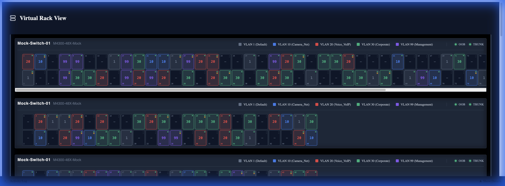

# HoneyBadger Switch Manager

A real-time visual controller and monitoring dashboard for Netgear M4300 series switches.



## Features

- **Visual Rack View**: Interactive faceplates that mirror physical hardware.
- **Dual Connectivity**: Automatically checks and routes via OOB Management or Trunk IPs for redundancy.
- **Dynamic Discovery**: Auto-detects Switch Name, Model, Port Count, and VLAN configuration from the hardware.
- **Mobile Responsive**: Fully functional on tablets and phones for on-site management.
- **Real-time Control**: Toggle PoE, set VLANs, and view port status dynamically.

## Getting Started

### Prerequisites
- Node.js (v18 or higher)
- Network access to Netgear M4300 switches (SSH enabled)

### Installation

1. Clone the repository:
   ```bash
   git clone https://github.com/MichaelEdwards83/Switch-Dashboard-Control.git
   cd Switch-Dashboard-Control
   ```

2. Configure credentials:
   Copy the example environment file and update it with your switch credentials.
   ```bash
   cp .env.example .env
   ```
   
   **Edit `.env`:**
   ```ini
   SWITCH_USER=admin
   SWITCH_PASS=your_real_password
   MOCK_MODE=false # Set to true to test without hardware
   ```

### Running the Application

**Windows**
Double-click `start_windows.bat`.

**Mac / Linux**
Open a terminal and run:
```bash
./start_mac.sh
```

The application will launch at `http://localhost:5173`.

## Architecture
- **Frontend**: React + Vite (Visual Faceplates, Interactive Modal)
- **Backend**: Node.js + Express (SSH Management, Data Parsing)
- **Communication**: REST API polling with smart caching and failover logic.

## License
MIT
